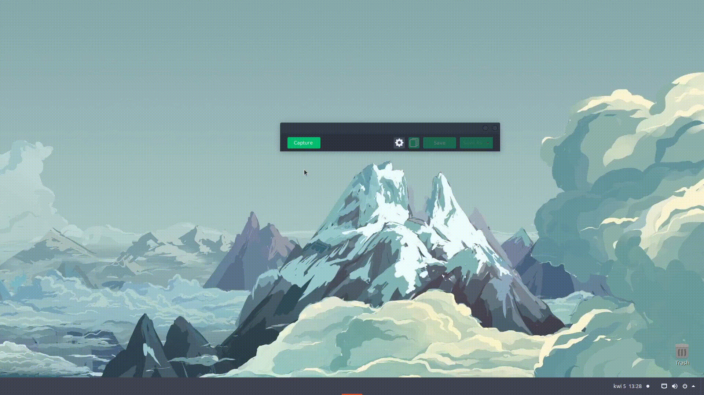

# Scissors

Scissors is a simple JavaFX application that allows you to take screenshots and upload them to Imgur.

### Features
- Take screenshot
- Edit screenshot
- Autosave screenshot to selected directory
- Copy screenshot to clipboard
- Upload screenshot to Imgur
- Define favorite directories for quick screenshot saving
- Change overlay opacity

### Build from source

#### Prerequisites
- JDK v16.0.1 (or higher)
- OpenJFX v16 (or higher)
- Apache Maven 3.8.4 (or higher)

#### Build using only maven
1. Open terminal in project root directory
2. Execute commands:
```
$ mvn clean
$ mvn package
```
3. Compiled source code should be in directory `./target/classes/` and .jar file in `./target/`
4. Run application by executing:
```
$ java --module-path PATH-TO-OpenJFX/lib --add-modules javafx.controls,javafx.fxml -jar JAR-FILE-NAME.jar
```

#### Build using Intellij
1. Open project in Intellij
2. Go to: `File -> Project Structure... -> Artifacts`
3. Click `+` icon and select: `JAR -> From modules with dependencies...`
4. Select Main Class: `com.fenrir.scissors.Scissors`
5. For `Directory for META-INF` select `resources` directory
6. Then go to `Build -> Build Artifacts.. -> Rebuild`
7. .jar file should be in directory `PROJECT-ROOT-DIR/out/artifacts/Scissors_jar/`
8. Run application by executing:
```
$ java --module-path PATH-TO-OpenJFX/lib --add-modules javafx.controls,javafx.fxml -jar JAR-FILE-NAME.jar
```

### Attribution
Icons made by [Freepik](https://www.freepik.com) from [www.flaticon.com](https://www.flaticon.com/)  
  
 
 
 
 
 
   

Icons made by [Lyolya](https://www.flaticon.com/authors/lyolya) from [www.flaticon.com](https://www.flaticon.com/)  
   

Icons made by [Icongeek26](https://www.flaticon.com/authors/icongeek26) from [www.flaticon.com](https://www.flaticon.com/)  
   

Icons made by [Pixel perfect](https://www.flaticon.com/authors/pixel-perfect) from [www.flaticon.com](https://www.flaticon.com/)  
   
